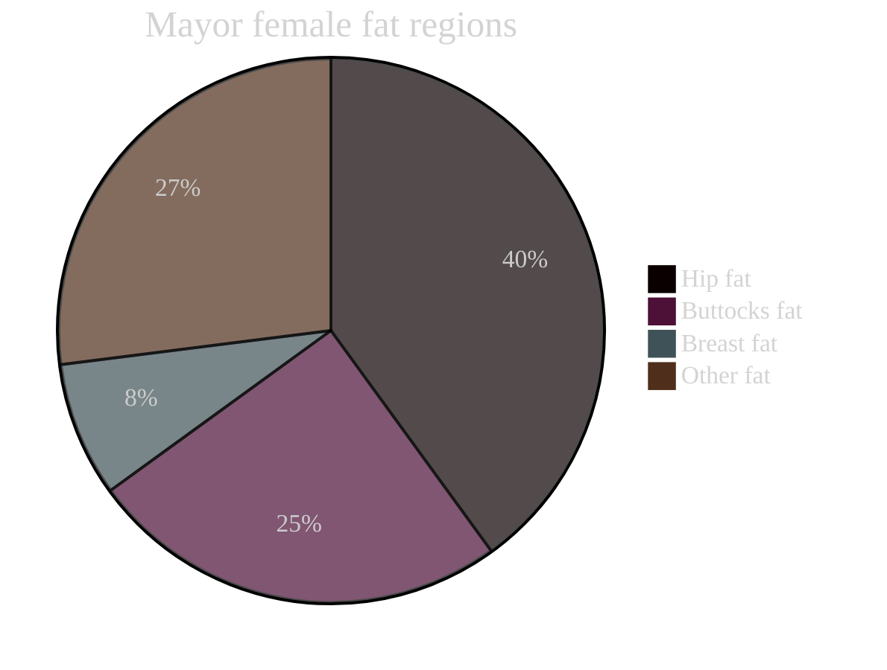

## Properly Making Use of Fat Regions
Clothing, rope/ chains and other things that interact with the body will act differently when touching muscly, bony or normal areas vs areas rich in fat.

More on that in the [[skindentation]] section.

## About the Fat Regions
The location and depth of fat regions are quite different between the male and female body. Generally people with more muscles will have less fat, however even strong females will still have a lot of fat comparatively to males who can almost entirely burn their fat. The main reason for this is that the female body tries to prepare for child bearing. For reference, according to [the American Council on Exercise](https://www.acefitness.org/education-and-resources/lifestyle/tools-calculators/percent-body-fat-calculator/), to function normally females need at least 10% body fat, whereas males only need 2%. This required amount of fat is also referred to as essential fat. 

On average, **female bodies** have is **21%-32% fat** [[1](https://www.webmd.com/fitness-exercise/what-is-body-composition)] while male bodies have 8%-19% fat on average, but that can vastly differ depending on the person.

There are two types of fat regions, **[subcutaneous fat](https://en.wikipedia.org/wiki/Subcutaneous_tissue)** and **visceral fat**. Of which only **subcutaneous fat** is of importance for artists, this type of fat region is located just beneath the skin and sits on the muscles. **visceral fat** regions surround internal organs and are thus not important.

_Also note that currently only female fat regions are covered here, male fat regions are quite different._

**The full list of female fat regions are as follows:**

>[!info] I split the fat regions into categories, that makes sculpting/ drawing them easier.

- [[Fat Regions#Breast Fat|Breast Fat]]
	- **Breast Fat**
- [[Fat Regions#Love Handles (Flank Fat Pad)|Love Handles (Flank Fat Pad)]]
	- **Flank fat pad**
- [[Fat Regions#Lower Back & But Fat Region|Lower Back & But Fat Region]]
	- **Lateral gluteal fat pad**
	- **Posterior gluteal fat pad**
	- **Outer thigh fat pad**
- [[Fat Regions#Below But Fat Region|Below But Fat Region]]
	- **Inferior gluteal fat pad**
	- **Inner thigh fat pad**
- [[Fat Regions#Pubic Fat Pad|Pubic Fat Pad]]
	- **Pubic fat pad**
- [[Fat Regions#Knee Fat Region|Knee Fat Region]]
	- **Lower anterior thigh fat pad**
	- **Infrapatellar fat pad**
	- **Popliteal fat pad**

![[Pasted image 20230605125503.jpg|600]]
![[Pasted image 20230710182150.png|600]]

> [!example]- Female body fat regions
> 
>![[Pasted image 20230605125529.png|500]]
>![[Pasted image 20230605125944.png|500]]
>![[Pasted image 20230605125955.png|500]]
>![[Pasted image 20230605130001.jpg|500]]
>![[Pasted image 20230605130008.jpg|500]]
>![[Pasted image 20230605130015.png|500]]
>![[Pasted image 20230625182707.png|500]]
>![[Pasted image 20230605130021.jpg|500]]
>![[Pasted image 20230605130031.png|500]]

## Breast Fat

![[Pasted image 20230626221139.png]]
![[Pasted image 20230626221148.png]]
![[Pasted image 20230626221229.png]]

_[[Wkipedia](https://en.wikipedia.org/wiki/Breast)]_

Breast fat also known as mammary fat is the fat region that differs the most between female bodies. The breasts lay on top of the [[Upper Body Muscles#Pectoralis Mayor|pectoralis mayor]] muscle and are visibly "one" with them. Although breasts aren't fully made of fat, for an artist one can think of them as a 100% fat tissue.

_To-Do: Sizes_

>[!example]- Breast fat reference
>
>![[Pasted image 20230626221036.png]]
>![[Pasted image 20230605130212.jpg|500]]
>![[Pasted image 20230605130223.png|500]]
>![[Pasted image 20230605130230.png|500]]
>![[Pasted image 20230605130236.png|500]]
>![[Pasted image 20230605130242.png|500]]
>![[Pasted image 20230605130248.jpg|500]]
>![[Pasted image 20230605130255.jpg|500]]
>![[Pasted image 20230605130304.jpg|500]]

## Abdominal Fat Pad
![[Pasted image 20230626222004.png]]
![[Pasted image 20230626222016.png]]

The **abdominal fat pad** starts under the belly button/ the lowest section of six-pack. It's quite visible from the side view.

>[!example]- Abdominal fat reference
>
>![[Pasted image 20230626222009.png]]
>![[Pasted image 20230626222023.png]]
>![[Pasted image 20230626222030.png]]
>![[Pasted image 20230626222038.png|300]]

## Love Handles (Flank Fat Pad)

![[Pasted image 20230710171329.png]]
![[Pasted image 20230710171336.png]]

The **flank fat pad** also known as **love handles**, gives the illusion of higher hips because the waistline starts earlier. This fat pad also reaches more to the front than the **lateral gluteal fat pad** below it.

>[!example]- Love handles (flank fat pad) reference
>
>![[Pasted image 20230710171136.png]]
>![[Pasted image 20230710171143.png]]
>![[Pasted image 20230710171149.png]]

## Lower Back & But Fat Region

![[Pasted image 20230710145802.png]]
![[Pasted image 20230710145808.png]]

**The lower back & but fat region** consists of the:
- **Lateral gluteal fat pad**
- **Posterior gluteal fat pad** 
- **Outer thigh fat pad**

>[!example]- Lower back & but fat region reference
>
>![[Pasted image 20230710145844.png]]
>![[Pasted image 20230710145858.png]]
>![[Pasted image 20230710145904.png]]

## Below But Fat Region

The **below but fat region** consists of the:
- **Inferior gluteal fat pad** 
- **Inner thigh fat pad**

## Pubic Fat Pad

![[Pasted image 20230710180604.png]]
![[Pasted image 20230710135349.png]]
![[Pasted image 20230710135323.png|450]]

The **pubic fat pad** also knows as **mons pubis** is the main cause for the camel toe/ pudental cleft that can sometimes be seen through females undergarments.

>[!example]- Pubic fat pad reference
>
>![[Pasted image 20230710135342.png]]

## Knee Fat Region

![[Pasted image 20230710174815.png]]
![[Pasted image 20230710175805.png]]

_Wikipedia: [[Infrapatellar fat pad]](https://en.wikipedia.org/wiki/Infrapatellar_fat_pad)_

The knees have fat located on the front and back side. 

On the front side of the knee, there are:
- **Lower anterior thigh fat pad**
- **Infrapatellar fat pad**

On the back side of the knee, there is:
- **Popliteal fat pad**

The **lower anterior thigh fat pad** also known as **suprapatellar fat pad** is located above the [[Skeleton#Leg Bones|patella]] (kneecap).

The **infrapatellar fat pad** also known as **hoffa's fat pad** is located on the left and right side below the [[Skeleton#Leg Bones|patella]] (kneecap). It's a small pocket of fat situated between the [[Skeleton#Leg Bones|femur]] (thigh bone) and the [[Leg Muscles#Quadriceps femrois|quadriceps]] tendon, which covers the front of the knee.

The **popliteal fat pad** is located behind the knee and nicely fits between the [[Leg Muscles#Hamstrings|semitendinosus]] and [[Leg Muscles#Hamstrings||biceps femrois]] muscles.

>[!example]- Knee fat region reference
>
>![[Pasted image 20230710175828.png]]
>![[Pasted image 20230710175834.png]]
>![[Pasted image 20230710175839.png]]
>![[Pasted image 20230710175848.png]]